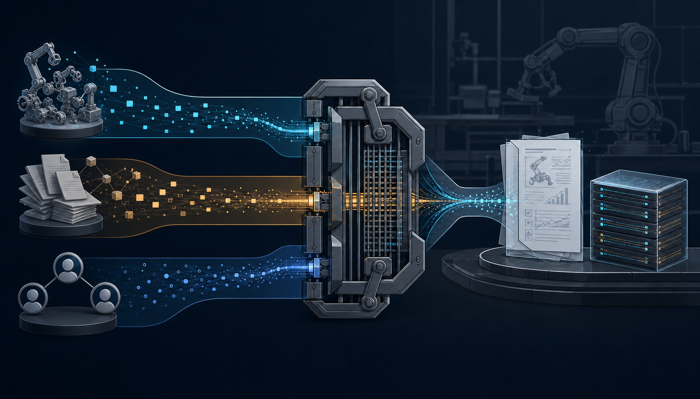

# ai-ideas

An auditable research-idea discovery harness for embodied AI.



`ai-ideas` runs generation, prior-work research, and review in separate processes. Bash owns shortlist construction, minimum-vote aggregation, ledger mutation, archives, and publication. A Strong Accept requires unanimous reviewers plus the mechanical evidence gates defined in [`PROGRAM.md`](PROGRAM.md).

- Independent prior-work evidence prevents the generator from grading its own novelty claim.
- Every prescreen direct hit and deeply reviewed candidate receives an append-only ledger record.
- Per-run archives preserve the inputs, ballots, reasons, overlap judgment, and ledger delta needed to audit a decision.

## Pipeline

```text
policy + bounded generation brief from SQLite
  -> generate -> rank -> direct-hit prescreen -> adversarial prior-work research
  -> independent reviewers -> deterministic minimum vote -> ledger
  -> report -> branch + pull request
```

The main loop writes live state under `tmp/round/`, canonical history to `.ai-ideas/history.sqlite3`, replayable projections to `ledger.tsv` and `tmp/ledger.good`, accepted reports to `ideas/`, and per-run archives outside the checkout. [`docs/architecture.md`](docs/architecture.md) defines stage and artifact ownership.

## Quick Start

The default v2 path requires Bash, Git, an authenticated Codex CLI, network
access, and an authenticated `gh` session for publication. Hunt v2 supports
Codex, Kimi, Grok, and Claude for its internal stages. Selecting a non-Codex
internal provider does not change the Codex default used by selector,
prescreen, external research, and report stages; a host without Codex must
configure compatible `AGENT_CMD` / `FRONT_CMD` / `BACK_CMD` values. With
`HUNT_PROVIDER=kimi` and no Codex executable on `PATH`, those stages fall
back to the kimi CLI automatically; with a Codex binary present but
unauthenticated, set `AGENT_CMD` explicitly instead.

```bash
git clone git@github.com:axiat/ai-ideas.git
cd ai-ideas
HISTORY_RUNTIME_ABI=v2 ./hunt.sh
```

`./hunt.sh` is an active run, not a dry run. It invokes model and search backends, commits canonical history to SQLite, projects `ledger.tsv`, and may push a daily branch and open a pull request after a qualifying report. Shipped history mode is `shadow`: internal retrieval is observational for a fixed generated batch, and external research/review remain the sole ledger authority. Operational defaults and recovery procedures are in [`docs/getting-started.md`](docs/getting-started.md).

## Directed Run

```bash
HISTORY_RUNTIME_ABI=v2 \
RESEARCH_DIRECTION_FILE='directions/dynamic-spatial-memory-vla-v1.json' \
  caffeinate -is ./hunt.sh
```

The repository-relative contract is canonicalized before any agent invocation. Every raw candidate must carry exact `Direction Axis`, `Target Failure`, and `Direction Evidence` fields and pass independent selector classification. A missing, malformed, or `out-of-scope` result rejects the whole batch before history retrieval and research. Resume requires the same canonical direction identity. With `RESEARCH_DIRECTION_FILE` unset, broad generation retains its existing contract.

The semantic classifier is an independent model judgment wrapped by fail-closed orchestration; it is not a proof of natural-language meaning.

## Project Mode

An external topic folder can drive hunts while the master ledger stays in this checkout. Register the folder once, then name it per run:

```bash
python3 lib/history_cli.py project-add mytopic /abs/path/to/mytopic
HUNT_PROJECT=mytopic ./hunt.sh
```

The project directory needs only a `direction.json`: copy any `directions/*.json` contract there and rename it. `project-add` requires an absolute, non-symlink directory outside the checkout and validates the contract at registration. `HUNT_PROJECT_DIR=/abs/path` runs an unregistered directory directly. Both modes stage the direction by copy, print `mode=project <name> <dir>` at startup, tag committed rows with the project name, and export each round's new ledger rows to `<project>/harvest/` (slice, manifest, and the run's report on Strong Accept). Project mode requires an existing `.ai-ideas/history.sqlite3`: on a fresh clone, run one default hunt first to create the database.

Harvest slices are read-only snapshots; re-import is unsupported because row identity is position-dependent. Query the master ledger for history. Operational rules:

- `SA_TARGET` is global across projects and modes.
- Hunts are serial: one `hunt.sh` process holds the repository lock at a time, regardless of mode.
- Editing a project's `direction.json` changes its direction identity, and resume then refuses the run, as with `RESEARCH_DIRECTION_FILE`.
- Moving a project folder rots the registry pointer; re-run `project-add` with the new path (the harvest mark is preserved).
- Ad-hoc per-project lookup runs against the master ledger:

```bash
sqlite3 .ai-ideas/history.sqlite3 \
  "SELECT date, theme, story, verdict FROM candidates
   WHERE json_extract(provenance_json, '$.project') = 'mytopic'
   ORDER BY source_sequence"
```

Operational detail is in [`docs/getting-started.md`](docs/getting-started.md).

## Artifacts

The durable accounting surface is an eight-column TSV:

```text
date  source  theme  idea  verdict  reason  overlap  category
```

Historical seven-column rows remain valid. Accepted reports use `ideas/YYYY-MM-DD_hunt*.md`. Archived rounds contain a manifest, frozen decision inputs, logs, and a ledger delta under `$HOME/.ai-ideas-runs/$(basename "$PWD")/<run_id>/` by default.

## Provider Selection

Omitted reasoning uses the selected CLI's current default. Omitted models use
the Codex, Kimi, Grok, and Claude defaults. OpenCode omission requires a safe host
configuration probe and launches with that effective model pinned; agy
requires an explicit model. Every OpenCode/agy model must exactly match the
current bounded local `models` catalog, whose identity is checked again before
launch. Hunt accepts `codex`, `kimi`, `grok`, and `claude`; AwR additionally
accepts `opencode` and `agy`.

AwR with agy requires Agy 1.1.8+ and an explicit catalog model. Claude and Agy
use structured JSON transports; the contracts are in
[docs/backends.md](docs/backends.md).

```bash
HISTORY_RUNTIME_ABI=v2 HUNT_PROVIDER=kimi ./hunt.sh
HISTORY_RUNTIME_ABI=v2 HUNT_PROVIDER=grok ./hunt.sh
HISTORY_RUNTIME_ABI=v2 HUNT_PROVIDER=claude ./hunt.sh
HISTORY_RUNTIME_ABI=v2 AWR_PROVIDER=opencode AWR_MODEL=openai/gpt-5.6-sol SIDE_POLL_SEC=0 ./awr-side.sh
HISTORY_RUNTIME_ABI=v2 AWR_PROVIDER=agy AWR_MODEL=gemini-3.6-flash-high SIDE_POLL_SEC=0 ./awr-side.sh
HISTORY_RUNTIME_ABI=v2 AWR_PROVIDER=claude AWR_MODEL=sonnet SIDE_POLL_SEC=0 ./awr-side.sh
```

`HUNT_PROVIDER` controls the portable internal stages. Route Hunt's external
selector, prescreen, prior-work research, and report stages through an explicit
worker with `AGENT_CMD`. Omitting both model variables and both reasoning
variables keeps the selected CLI's current defaults:

```bash
HISTORY_RUNTIME_ABI=v2 \
HUNT_PROVIDER=kimi \
AGENT_CMD='kimi --output-format text -p' \
./hunt.sh

HISTORY_RUNTIME_ABI=v2 \
HUNT_PROVIDER=grok \
AGENT_CMD='./grok-worker.sh' \
./hunt.sh

HISTORY_RUNTIME_ABI=v2 \
HUNT_PROVIDER=claude \
AGENT_CMD='./claude-worker.sh' \
./hunt.sh
```

Pin the same explicit model and reasoning effort on both paths when a fixed
run configuration is required:

```bash
HISTORY_RUNTIME_ABI=v2 \
HUNT_PROVIDER=grok \
HUNT_MODEL=grok-4.5 \
HUNT_REASONING_EFFORT=high \
AGENT_CMD='./grok-worker.sh' \
GROK_MODEL=grok-4.5 \
GROK_REASONING_EFFORT=high \
./hunt.sh

HISTORY_RUNTIME_ABI=v2 \
HUNT_PROVIDER=claude \
HUNT_MODEL=sonnet \
HUNT_REASONING_EFFORT=high \
AGENT_CMD='./claude-worker.sh' \
CLAUDE_MODEL=sonnet \
CLAUDE_REASONING_EFFORT=high \
./hunt.sh
```

Exact model/reasoning spelling for every provider, role-specific overrides,
the external Hunt stage boundary, and the v1 removal are in
[`docs/backends.md`](docs/backends.md).

## Calibration

Frozen panels test verdict logic against fixed evidence; end-to-end negative controls test retrieval recall against known occupants.

```bash
./calib/run_all.sh
./calib/run_e2e.sh calib/cases/neg-replai
```

Both commands invoke configured backends. The deterministic offline ABI gate is `bash tests/calibration_abi_smoke.sh`. Case semantics and the expectation DSL are canonical in [`calib/README.md`](calib/README.md).

## Recovery and Trust Boundaries

Valid interrupted front-stage artifacts resume with fresh review ballots. Decision archives live outside the workspace by default; an incomplete Strong Accept archive creates `tmp/HALTED-ARCHIVE-FAIL` and blocks restart and publication until the archive or ledger state is repaired. Repository guards, disposable mirrors, local hooks, and CI path checks reduce accidental cross-surface writes; they are not an adversarial process or host boundary.

Recovery details are in [`docs/getting-started.md`](docs/getting-started.md). Filesystem, network, process, publishing, and CI guarantees are in [`docs/trust-boundaries.md`](docs/trust-boundaries.md).

## Documentation

- [`docs/getting-started.md`](docs/getting-started.md) — prerequisites, first run, result locations, recovery, and settlement
- [`docs/architecture.md`](docs/architecture.md) — stages, data flow, and artifact ownership
- [`docs/backends.md`](docs/backends.md) — exact backend defaults and explicit overrides
- [`docs/trust-boundaries.md`](docs/trust-boundaries.md) — enforced boundaries and their limits
- [`PROGRAM.md`](PROGRAM.md) — canonical runtime protocol and ledger schema
- [`calib/README.md`](calib/README.md) — calibration cases, tracks, and interpretation
- [`CONTRIBUTING.md`](CONTRIBUTING.md) — local validation and change conventions

## Scope

`ai-ideas` is a local, shell-orchestrated embodied-AI research workflow. It is not a hosted service, general-purpose topic framework, package, or adversarial sandbox. Publication targets the configured Git remote through daily `hunt/<date>` or `weekly/<date>` branches and pull requests.
